<div align="center">



# 🚀 Awesome Technical Interview Platform

**A curated index of top SaaS products, open-source online judges, sandboxed code execution engines, and technical assessment infrastructure.**

<p align="center">
  <a href="https://github.com/ishandutta2007/Awesome-Awesome-Awesome"></a>
  <a href="https://discord.gg/jc4xtF58Ve"></a>
  <a href="https://github.com/ishandutta2007/Awesome-Technical-Interview-Platform/stargazers"></a>
  <a href="https://github.com/ishandutta2007/Awesome-Technical-Interview-Platform/network/members"></a>
  <a href="https://github.com/ishandutta2007/Awesome-Technical-Interview-Platform/blob/main/LICENSE"></a>
  <a href="https://github.com/ishandutta2007/Awesome-Technical-Interview-Platform/pulls"></a>
  <a href="https://github.com/ishandutta2007"></a>
</p>

*Last updated: August 2026*

</div>

---

## 📖 Overview

This repository is a comprehensive, community-curated collection of **SaaS platforms** and **open-source software** built for **Technical Interviews, Live Collaborative Coding, Automated Assessments, Take-Home Projects, and Candidate Evaluation**. 

Whether you are an engineering leader architecting a low-bias hiring funnel, a startup evaluating candidate screening software, or a platform engineer deploying a self-hosted online judge with sandboxed code execution, this guide provides actionable comparisons, transparent pricing, valuation benchmarks, and star-ranked open-source alternatives.

---

## 🔍 SEO & Key Search Terms

`technical interview platform` • `coding assessment software` • `online judge open source` • `live pair programming IDE` • `take home coding test` • `candidate screening tool` • `sandboxed code execution` • `judge0` • `dmoj` • `algorithmic assessment` • `technical hiring infrastructure` • `developer evaluation platform` • `cheat detection and proctoring`

---

## 📑 Table of Contents

- [🏢 SaaS & Hosted Platforms](#-saas--hosted-platforms)
- [🔓 Open-Source GitHub Projects](#-open-source-github-projects)
- [🏗️ Architectural Guide: Building a Self-Hosted Platform](#️-architectural-guide-building-a-self-hosted-platform)
- [🤝 How to Contribute](#-how-to-contribute)
- [⭐ Star History](#-star-history)
- [⚖️ Disclaimer](#️-disclaimer)

---

## 🏢 SaaS & Hosted Platforms

A breakdown of top commercial technical interview platforms, sorted **descending by company valuation & scale**. All entries feature verified starting tier pricing and specific free tier or free trial limits.

| Platform | Valuation / Scale (Est.) | Description | Pricing (Starting Tier) | Free Tier / Trial Limit |
| :--- | :--- | :--- | :--- | :--- |
| **[Karat](https://karat.com/)** | **$1.1B Valuation** (~$74M ARR, $248M Raised) | Leading Interview-as-a-Service platform providing trained human interview engineers to conduct first-round technical interviews on behalf of hiring companies. | Pay-per-interview model starting at $200–$450 per conducted interview (tiered volume pricing) | Free mock technical interviews for Black engineers via Brilliant Black Minds program; pilot trials (up to 10 interviews) for qualified organizations (no permanent free tier for employers) |
| **[HackerRank](https://www.hackerrank.com/)** | **~$500M Valuation** (~$220M–$378M ARR, $115M Raised) | Industry-standard coding assessment platform offering expansive question banks, automated testing, live interview rooms, and skills benchmarking for high-volume hiring. | Starter plan starts at $79/mo (billed annually at $948/yr, 60 candidate attempts/yr) or $99/mo | Free forever for individual developers (unlimited practice & certifications); 14-day free trial for corporate hiring platform |
| **[CodeSignal](https://codesignal.com/)** | **~$125M Valuation** (~$54M ARR, $90M Raised) | Technical assessment platform focused on standardized scoring (Coding Score), real-world multi-file coding tasks, and AI-assisted interview intelligence. | Build plan starts at $79/mo (billed annually at $948/yr, 60 credits/yr) or $99/mo | Free forever on CodeSignal Learn (daily regenerating energy limit); custom demo/pilot available for hiring teams (no permanent free hiring tier) |
| **[CoderPad](https://coderpad.io/)** | **~$50M–$80M Est. Valuation** (~$18M ARR, Summit Partners) | Live collaborative coding interview environment with real-time execution, 90+ runtime languages, drawing boards, and playback replays for interviewers. | Starts at $79/mo (billed annually) or $99/mo | Free forever plan with 2 interviews/tests per month; 14-day free trial for paid tiers |
| **[Codility](https://www.codility.com/)** | **~$50M–$70M Est. Valuation** (~$14M ARR, $22M Raised) | Enterprise-grade coding assessment platform known for rigorous test tasks, automated evaluation, plagiarism detection, and compliance tooling. | Starter plan starts at $1,200/yr (~$100/mo, 120 test invites/yr) | 7-day free trial (includes up to 15 test invites); no permanent free tier for employers |
| **[Interviewing.io](https://interviewing.io/)** | **~$30M–$50M Est. Valuation** (~$5M–$10M ARR, $13M Raised) | Anonymous technical mock interview and hiring platform pairing candidates with senior engineering interviewers from FAANG and top-tier tech companies. | Starts at $115–$179 per mock session (or multi-session coaching packages from $1,500) | Free forever practice problems and recorded interview guides + 1 free peer mock interview on sign-up (earn more by conducting peer mocks) |
| **[Qualified](https://www.qualified.io/)** | **Acquired by Andela** (Parent Valued at $1.5B; Pre-Acq ARR ~$2.5M–$5M) | Technical screening and live pair-programming platform combining auto-graded unit-test challenges with project-scale IDEs (by the creators of Codewars). | Starter plans start from ~$100–$300/mo (annual subscription model) | 14-day free trial (includes up to 5 assessment results); no permanent free tier |
| **[Byteboard](https://byteboard.dev/)** | **Acquired by Karat** (Parent Valued at $1.1B; $5M Seed Raised) | Work-sample engineering assessment platform evaluating practical asynchronous software development, design documents, and real-world code reviews. | CoreEval pay-per-use starts at $300 per interview ($135/interview with 55% early-stage startup discount) | 14-day free trial for CodeCollab (unlimited collaborative live-coding sessions); no permanent free tier for evaluations |
| **[DevSkiller](https://devskiller.com/)** | **~$10M–$15M Est. Valuation** (~$2M–$4M ARR, $2.4M Raised) | Skills-testing and verification engine powered by RealLifeTesting™ methodology, assessing full-stack frameworks, databases, and code repos. | TalentScore plans start at $399/mo (~$4,788/yr billed annually) | 7-day free trial (evaluates up to 15 candidates); no permanent free tier |
| **[CodeSubmit](https://www.codesubmit.io/)** | **Bootstrapped** (~$250K–$500K ARR, Self-Funded) | Take-home technical challenge and coding assessment platform focused on practical project tasks and streamlined candidate submissions. | Solo plan starts at $49/mo (or $39/mo billed annually, 3 candidate credits/mo); Startup plan at $199/mo | 7-day free trial with sample library assignments (no credit card required upfront); no permanent free tier |

---

## 🔓 Open-Source GitHub Projects

Curated collection of open-source online judges, collaborative coding tools, and code execution sandboxes, sorted **descending by GitHub stars**.

- **[yjs/yjs](https://github.com/yjs/yjs)** [](https://github.com/yjs/yjs/stargazers)  
  ⚡ High-performance Conflict-free Replicated Data Type (CRDT) framework for building real-time collaborative coding interview rooms and multi-user paired code editors.

- **[QingdaoU/OnlineJudge](https://github.com/QingdaoU/OnlineJudge)** [](https://github.com/QingdaoU/OnlineJudge/stargazers)  
  🏆 Full-featured, modern open-source online judge system built with Django, Vue.js, Docker sandboxing, ACM/ICPC/OI scoring rules, and anti-cheating analytics.

- **[judge0/judge0](https://github.com/judge0/judge0)** [](https://github.com/judge0/judge0/stargazers)  
  ⚙️ Production-ready, robust, scalable, and sandboxed code execution engine supporting 60+ programming languages via a simple REST API. Used as the backend for dozens of interview platforms.

- **[zhblue/hustoj](https://github.com/zhblue/hustoj)** [](https://github.com/zhblue/hustoj/stargazers)  
  🏫 Popular and battle-tested open-source online judge system widely used by universities and training organizations for programming exams and automated problem grading.

- **[engineer-man/piston](https://github.com/engineer-man/piston)** [](https://github.com/engineer-man/piston/stargazers)  
  🚀 High-performance, general-purpose isolated code execution engine designed for running untrusted code safely at high throughput across multiple runtimes.

- **[ioi/isolate](https://github.com/ioi/isolate)** [](https://github.com/ioi/isolate/stargazers)  
  🔒 Secure sandbox environment developed for the International Olympiad in Informatics (IOI), leveraging Linux cgroups and namespaces for deterministic, safe code evaluation.

- **[DMOJ/online-judge](https://github.com/DMOJ/online-judge)** [](https://github.com/DMOJ/online-judge/stargazers)  
  🌐 Modern, scalable open-source online judge and contest system supporting 60+ languages, interactive tasks, custom output checkers, and multi-node judging backends.

- **[judge0/ide](https://github.com/judge0/ide)** [](https://github.com/judge0/ide/stargazers)  
  💻 Sleek, open-source online code editor and collaborative execution IDE interface powered directly by Judge0 CE/PE APIs.

- **[ZsgsDesign/NOJ](https://github.com/ZsgsDesign/NOJ)** [](https://github.com/ZsgsDesign/NOJ/stargazers)  
  ✨ Advanced open-source automatic algorithm online judge platform built with Laravel, Docker, and Vue with multi-dialect support and custom problem setters.

- **[HimitZH/HOJ](https://github.com/HimitZH/HOJ)** [](https://github.com/HimitZH/HOJ/stargazers)  
  ⚡ Distributed microservice online judge platform based on Spring Boot, Spring Cloud Alibaba, and Vue.js with integrated remote judging capabilities.

- **[syzoj/syzoj](https://github.com/syzoj/syzoj)** [](https://github.com/syzoj/syzoj/stargazers)  
  🎯 Next-generation open-source online judge system crafted with Node.js and sandbox runners, specialized for competitive programming and fast feedback.

- **[CoderScreen/coderscreen](https://github.com/CoderScreen/coderscreen)** [](https://github.com/CoderScreen/coderscreen/stargazers)  
  💼 Self-hostable technical hiring platform supporting live interactive coding interviews, auto-graded screening tasks, and take-home project evaluations.

- **[ATOAPaymentsLimited/CodeVerdict](https://github.com/ATOAPaymentsLimited/CodeVerdict)** [](https://github.com/ATOAPaymentsLimited/CodeVerdict/stargazers)  
  📊 Self-hosted coding exam and candidate assessment platform featuring Monaco editor integration, Judge0 runtime execution, and live scoring leaderboards.

- **[hb1998/CodeGaze](https://github.com/hb1998/CodeGaze)** [](https://github.com/hb1998/CodeGaze/stargazers)  
  🔍 Open-source code screening tool for creating custom engineering challenges, running test cases, and evaluating applicant submissions with Judge0.

- **[yuan-alex/open-interview](https://github.com/yuan-alex/open-interview)** [](https://github.com/yuan-alex/open-interview/stargazers)  
  🧑‍💻 Open-source live technical interview room built with Next.js, WebSockets, and Judge0-backed code execution.

---

## 🏗️ Architectural Guide: Building a Self-Hosted Platform

For organizations aiming to eliminate recurring per-candidate SaaS seat costs or maintain strict candidate data sovereignty:

```
┌──────────────────────────────────────────────────────────┐
│                   Applicant / Candidate                  │
└────────────────────────────┬─────────────────────────────┘
                             │ HTTPS / WebSockets
┌────────────────────────────▼─────────────────────────────┐
│             Web UI & Live Interview Room                 │
│    (Next.js / Vue / Monaco Editor / Yjs Collaborative)   │
└────────────────────────────┬─────────────────────────────┘
                             │ REST / gRPC
┌────────────────────────────▼─────────────────────────────┐
│                 Core Assessment Engine                   │
│      (DMOJ / CoderScreen / CodeVerdict / Custom API)     │
└──────────────┬─────────────────────────────┬─────────────┘
               │                             │
┌──────────────▼─────────────┐ ┌─────────────▼─────────────┐
│   Isolated Sandbox Node    │ │    Applicant Tracking     │
│ (Judge0 / Piston / Isolate)│ │   (Greenhouse / Lever)    │
└────────────────────────────┘ └───────────────────────────┘
```

1. **Frontend Editor**: Integrate [Monaco Editor](https://github.com/microsoft/monaco-editor) or [CodeMirror](https://codemirror.net/) with [Yjs](https://github.com/yjs/yjs) for low-latency collaborative typing.
2. **Backend Assessment**: Deploy [CoderScreen](https://github.com/CoderScreen/coderscreen), [CodeVerdict](https://github.com/ATOAPaymentsLimited/CodeVerdict), or [DMOJ](https://github.com/DMOJ/online-judge) for test case lifecycle and scoring logic.
3. **Execution Sandbox**: Route candidate code submissions to a dedicated [Judge0](https://github.com/judge0/judge0) or [Piston](https://github.com/engineer-man/piston) cluster isolated with [Isolate](https://github.com/ioi/isolate) or gVisor.
4. **ATS Webhooks**: Dispatch automated score cards and execution telemetry to your HRIS/ATS via standard webhooks.

---

## 🤝 How to Contribute

Contributions are warmly welcomed! To suggest a platform or update existing metrics:

1. 🍴 Fork this repository.
2. 📝 Edit `README.md` following the established table structure or open-source star badge format.
3. 🔗 Verify all pricing, free tier limits, and URLs are accurate and sourced.
4. 🚀 Submit a Pull Request with a clear description of your additions.

---

## ⭐ Star History

[](https://star-history.dera.page/#ishandutta2007/Awesome-Technical-Interview-Platform&type=date&legend=top-left)

---

## ⚖️ Disclaimer

- This list is **community-maintained** for informational purposes and does not constitute an official endorsement.
- Pricing, subscription tiers, and free trial allowances are subject to change by vendors; always check official vendor sites before making procurement decisions.
- Self-hosted online judges execute untrusted candidate code—ensure Linux cgroups, namespaces, seccomp filters, and firewall boundaries are properly hardened in production environments.

---

<div align="center">

Made with ❤️ for engineering hiring managers, tech recruiters, and platform developers.

**[⬆ Back to Top](#-awesome-technical-interview-platform)**

</div>
